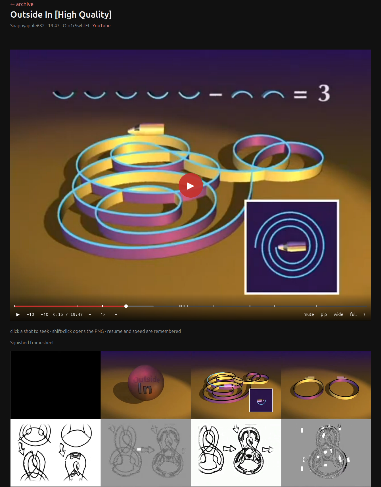

# yt-archive

Sibling of [matthoom](https://github.com/ernop/matthoom). Matthoom already has YouTube **watch history** (Takeout) and a gallery that can mark videos `to_archive`. This service does the other half: **download the video** and **make local shot images**.



```
matthoom          history, browse, mark to_archive     :8004
ytarchive         paste URL → download + squash sheet  :8765
                  http://ytarchive.localhost
```

Web UI: paste any YouTube URL variant, hit **Get**. That downloads the video and builds the squished framesheet. The lower half of the page lists everything already archived, newest first (searchable); each row opens a details page (player + sheet + shot PNGs). A small SQLite catalog (`data/ytarchive.sqlite`) indexes those folders so the list/search does not re-read every `archive.json`. Files stay the source of truth; `./yt reindex` rebuilds the catalog.

```sh
./yt get <url-or-id>
./yt serve          # http://127.0.0.1:8765/
```

Files land in `data/<id>/`:

```
data/<id>/
  <title>-<id>.mkv          # original, sacred
  *.info.json  *.webp  archive.json  index.html
  _condensed/
    framesheet.png          # contact sheet of kept shots
    shots.json              # timestamps + keep/drop decisions
    shots/0000.png …
```

## Commands

```sh
./yt get <url-or-id>           # download + shots
./yt get <url-or-id> --skip-shots
./yt shots <id>                # shots only (video already on disk)
./yt list
./yt reindex               # rebuild sqlite catalog from data/
./yt serve [--port 8765]
```

`YT_ARCHIVE_DATA` overrides the data root. `YT_ARCHIVE_PYTHON` overrides the ML venv (default: mybrowser framesheets venv).

From matthoom:

```sh
uv run python manage.py archive_youtube <id>
uv run python manage.py archive_youtube --pending    # everything marked to_archive
```

## Why these tools (from mybrowser)

Pulled from `mybrowser/framesheets/framesheet-guide.md` and `mybrowser/infrastructure/pc-linux-machine.md`. Do not reinvent the rejected approaches.

### Download (yt-dlp)

- Official standalone binary at `~/.local/bin/yt-dlp` (self-updates with `yt-dlp -U`). Apt copy is stale.
- Format is locked to **highest resolution**: `-f bv*+ba/b -S res,fps,hdr,vcodec:av01:vp9.2:vp9:h264` (best video + best audio, any container). Do not prefer mp4 — that can pick 1080p AVC over 4K VP9/AV1.
- **Firefox cookies required** (as of 2026-08-14). Anonymous downloads via android_vr get HTTP 403 after ~10 MB; web/ios/tv refuse without a PO token. Authenticated requests have no cutoff.
- **JS runtime required** or yt-dlp says "This video is not available". Deno is the default (sandboxed). Node also works; this machine uses Deno 2.9.5.
- `--restrict-filenames` — names stay in `[A-Za-z0-9._-]`. YouTube ids (`[A-Za-z0-9_-]`, case-sensitive) pass through unchanged.

Older `mybrowser/movie-utils/ytdl_download.py` is a Windows movie-searcher helper (`Title (Year) [id].mp4` + sidecar). Same idea, different naming. This service uses `data/<id>/` so one video is one folder.

### Shots (TransNetV2 + CLIP)

Settled pipeline, 2026-08-14. Everything local (HF cache `~/.cache/huggingface`, ~600 MB CLIP; TransNetV2 weights ship with the pip package).

1. **TransNetV2** classifies every frame at 48×27. Detects hard cuts *and* dissolves. Transition frames belong to no shot. **No fixed sampling rate** — the video's editing decides tile count.
2. One keyframe per shot at the **temporal midpoint** (maximally far from both transitions, so never a crossfade blend), extracted at full resolution with ffmpeg.
3. **OpenCLIP ViT-B-32** (`laion2b_s34b_b79k`) embeds keyframes. A shot is dropped when cosine similarity to **any already-kept** frame is ≥ `0.90`. (mybrowser's `make_sheet.py` only compared consecutive shots — that misses slideshows that cycle the same photos.) Lower toward 0.85 for only hard scene changes; raise toward 0.96 to keep near-repeats.
4. Tiles shrink only if the long axis exceeds 800px, then a near-square grid.

CPU timing on this class of machine: shot detection dominates (~134 ms per video-second at 1080p). Keyframe extract ~85 ms/shot. CLIP ~17 ms/shot after a 1.3 s load. A 5–6 min 1080p clip is about a minute. Peak RAM ~1.7 GB. The framesheet venv is the CPU torch wheel (smaller install; fast enough). CUDA torch on the 5060 Ti is the upgrade if hour-long videos become routine.

### Rejected (do not reintroduce)

Tested on slideshows with slow crossfades:

1. 1 fps + thumbnail pixel diff — no principled threshold.
2. 1 fps + CLIP dedupe — metric is good (same scene ≥0.93, cuts ≤0.85) but 1/s samples catch mid-dissolve ghosts.
3. CLIP blend-detection (reconstruct a tile from neighbors) — flagged real photos. Embeddings are not linear over pixel blends.
4. 6 fps + per-second stability snap — worked, still an arbitrary time base. Superseded by shot detection.

## Setup (new machine)

```sh
# already on this box: yt-dlp, ffmpeg, deno, firefox
cd ~/proj/mybrowser/framesheets
python3 -m venv .venv
.venv/bin/pip install --index-url https://download.pytorch.org/whl/cpu torch torchvision
.venv/bin/pip install open_clip_torch transnetv2-pytorch
```

yt-archive reuses that venv via `./yt`.
